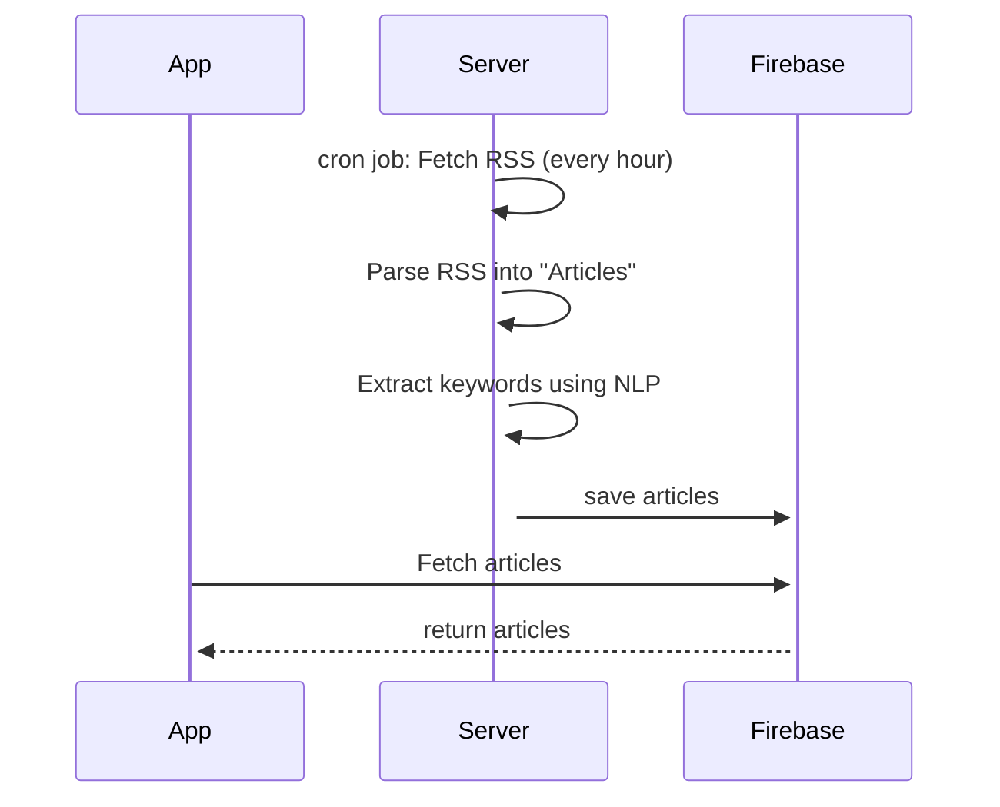

# NoppysBoard - Simple News Reader

STATUS: ~~published~~ no more available

## Description
Welcome to NoppysBoard!
- Customized User Experience: Implemented personalized home feeds allowing users to tailor their news consumption.
- Unique "Time Travel" Mode: Enabled users to revisit old news articles, providing a comprehensive historical perspective.
- Enhanced Readability: Added bookmark functionality for users to save articles for later reading, and a history feature to track previously visited articles.
- In-App Research Tools: Developed in-app search capabilities for users to perform web research without leaving the app, including:
    - Similar Articles Search: Quickly find related news content.
    - Keyword-Based Search: Efficiently locate information using keywords.
    - General Web Search: Perform comprehensive searches within the app.
- User-Centric Design: Included a dark mode for improved readability and reduced eye strain.

//--------------------------
Supported languages:
- English

## Stack & Tools
- Android (Java)
- Rxjava
- Firebase
- server for fetching news (Java) ([code](https://github.com/noppytinto/java-spring-scienceboardserver))
- NLP to search articles by keywords (server side)
- Axure for mocking

## Screenshots

