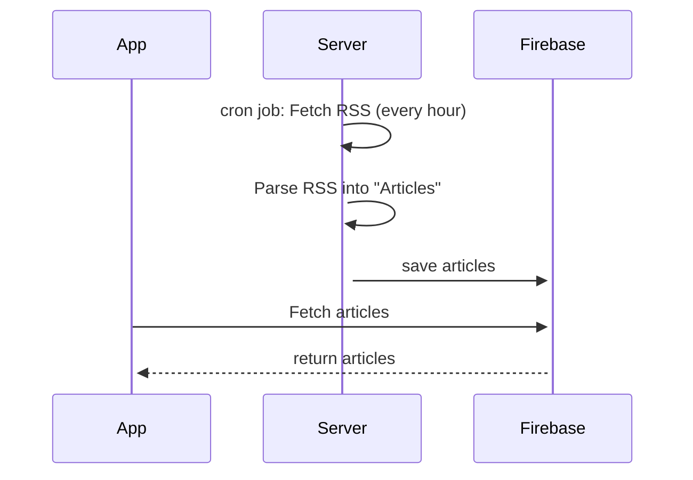

# NoppysBoard - Simple News Reader

STATUS: ~~published~~ no more available

## Description
Welcome to NoppysBoard!
- customize your home feed
- go back in time to see old news (time travel mode)
- save articles in bookmarks to read them later
- maybe you were reading an interesting article, but didn't have enough time, use the history to track previous visited articles
- when you're reading an article, you can do some research on the web without leaving the app:
- search similar articles on the web
- quick keywords based search
- or just search everything you want
- dark mode

//--------------------------
Supported languages:
- English

# Stack
- Android (Java)
- Rxjava
- Firebase
- server for fetching news (Java)

